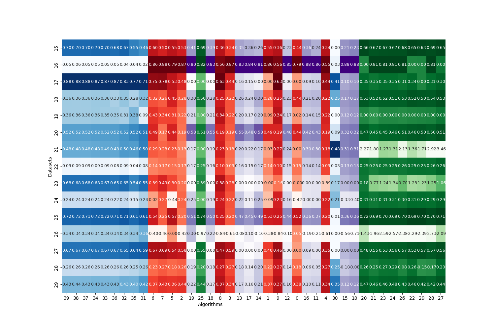
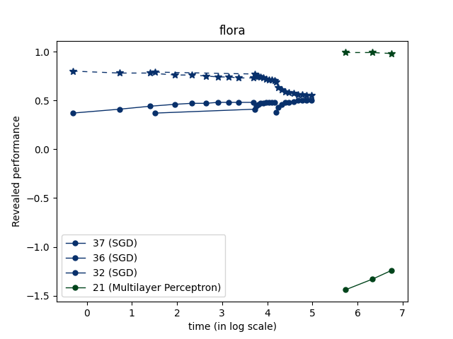

## DDQN action trajectories 

In this section, we provide the DDQN action trajectories across all datasets. Especially, Fig. 1 presents a ranked overview of algorithms by their average performance, helping to distinguish promising algorithm candidates from less favorable ones. Fig. 2 offers a detailed example of a complete trajectory.

*Fig 1: Algorithm Performance Ranking. This heatmap visually represents the performance of various algorithms, with each algorithm ordered from left to right based on its validation performance, averaged across datasets. The colors used to indicate algorithm families are: Blue=SVD, Red=Adaboost, Purple=KNN, Green=MultiLayer Perceptron. The block sturcture observed in this heatmap suggest a performance trend where blue outperforms red, red outperforms purple, and purple outperforms green.*

*Fig 2: DDQN action trajectory during meta-testing for dataset `flora`. The performance revealed with each action (solid line: validation performance, dashed line: train performance) is traced as a function of time. Each color labels the learning curve of an algorithm, indicated by their action numbers 0 - 39. The transparency of learning curves corresponds to the mean performance of the algorithm (darker is better). We observe the DDQN learns to start with good candidates (blue algorithms, ordered first in Fig. 1, and switch/continue training promising ones when achieving a performance plateau (e.g.  the agent switches from alg. 37 to previously partially trained alg. 36 around $t=exp(4)$.*
