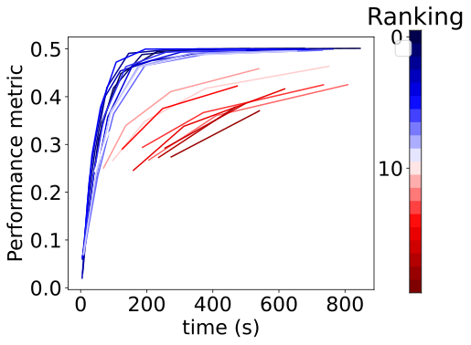

## Algorithms' learning curves with final rankings

In this folder, we provide insights into how algorithm rankings shift w.r.t. the training data size (see an example in Figure 1). This pertains to datasets where certain algorithm groups consistently outperform others in the learning curve. Algorithms are color-coded based on their final ranking. It can be seen that a group of algorithms represented in dark blue dominates throughout the entire learning curve. In other words, these algorithms that initially secures the top rank tends to maintain a remarkably high rank by the end of the process across most datasets. In such cases, BOS baseline can be more efficient compared to DDQN, as it can achieve comparable/better performances while being easier to implement.

*Fig 1: **Algorithm learning curves with final ranking on dataset *flora***. They are colored by their final rankings (last points on the curves). Algorithms highly ranked at the beginning (dark blue) often finished with high ranks as well.
